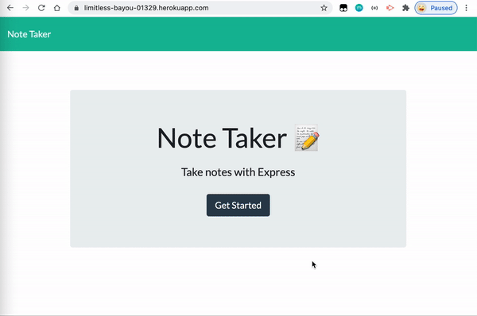

# Note Taker
This project is to create an application that can be used to write and save notes. This application use an Express.js back end and will save and retrieve note data from a JSON file.

## Table of Contents
* [Installation](#installation)
* [Built With](#built-with)
* [Features](#features)
* [Deployed Page](#deployed-page)
* [Demo GIF](#demo-gif)
* [Author](#author)
* [Questions](#questions)
* [Acknowledgments](#acknowledgments)

## Installation
```console
git clone https://github.com/qtian13/Note-Taker.git
npm init -y
npm i express
npm i uniqid
node server.js
```
## Built With
* [HTML](https://developer.mozilla.org/en-US/docs/Web/HTML)
* [CSS](https://developer.mozilla.org/en-US/docs/Web/CSS)
* [JavaScript](https://www.javascript.com/)
* [NodeJS](https://nodejs.org/en/)
* [npm](https://www.npmjs.com/)

## Features
1. When user open the Note Taker, they are presented with a landing page with a link to a notes page
2. When user click on the link to the notes page, they are presented with a page with existing notes listed in the left-hand column, plus empty fields to enter a new note title and the note’s text in the right-hand column
3. When user enter a new note title and the note’s text, a `Save icon` appears in the navigation at the top of the page
4. When user click on the `Save icon`, the new note they have entered is saved and appears in the left-hand column with the other existing notes
5. When user click on an existing note in the list in the left-hand column, that note appears in the right-hand column
6. When user click on the `Write icon` in the navigation at the top of the page, they are presented with empty fields to enter a new note title and the note’s text in the right-hand column

## Deployed Page
Deployed Page: [https://limitless-bayou-01329.herokuapp.com/notes](https://limitless-bayou-01329.herokuapp.com/notes)

## Demo GIF


## Author
Qiushuang Tian
- [Link to Portfolio Site](https://qtian13.github.io/myPortfolio/)
- [Link to Github](https://github.com/qtian13)
- [Link to LinkedIn](https://www.linkedin.com/in/qiushuang-tian-a9754248/)

## Questions
Please reach me out with additional questions!

Emails: qiushuang.tian@gmail.com

## Acknowledgments
- [Berkeley Coding Boot Camp](https://bootcamp.berkeley.edu/coding/) provided mock up image and front-end code